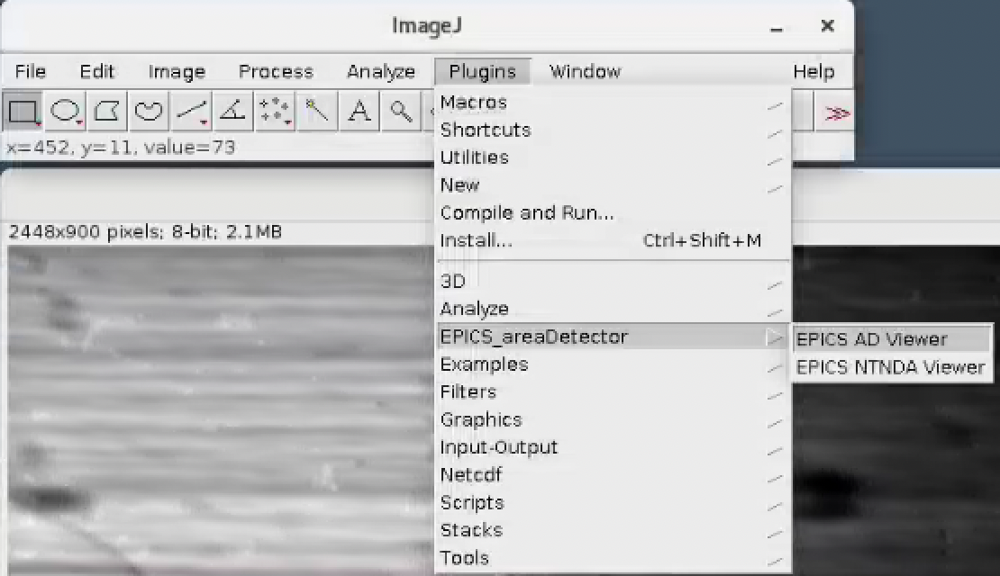

=========
pvaServer
=========

pvaServer CLI to stream image data to PVA

Usage
=====

::

	$ pvaserver -h
	usage: pvaserver [-h] [--config FILE] [--version]  ...

	optional arguments:
	  -h, --help     show this help message and exit
	  --config FILE  File name of configuration file
	  --version      show program's version number and exit

	Commands:
	  
	    init         Usage: pvaserver init - Create configuration file and restore the original default values
	    sim          Usage: pvaserver sim - Run the PVA server in simulation mode (-h for more options)
	    stack        Usage: pvaserver stack --file-path /data/ - Run the PVA server loading a stack of images from a folder (-h for more options)
	    tomo         Usage: pvaserver tomo --file-name tomo.h5 - Run the PVA server loading a tomo dataset (-h for more options)
	    status       Usage: pvaserver status - Show status

::

	$ pvaserver status
	2023-03-08 15:40:20,962 - Saving log at /home/beams/FAST/logs/pvaserver_2023-03-08_15_40_20.log
	2023-03-08 15:40:20,962 - pvaserver status start
	2023-03-08 15:40:20,962 - General
	2023-03-08 15:40:20,962 -   config           /home/beams/FAST/logs/pvaserver.conf
	2023-03-08 15:40:20,962 -   logs_home        /home/beams/FAST/logs
	2023-03-08 15:40:20,962 -   verbose          False
	2023-03-08 15:40:20,962 - Server
	2023-03-08 15:40:20,962 -   cache_size       1000
	2023-03-08 15:40:20,962 -   channel_name     pvapy:image
	2023-03-08 15:40:20,962 -   disable_curses   False
	2023-03-08 15:40:20,962 -   frame_rate       20.0
	2023-03-08 15:40:20,962 -   metadata_pv      -
	2023-03-08 15:40:20,962 -   n_frames         0
	2023-03-08 15:40:20,963 -   notify_pv        -
	2023-03-08 15:40:20,963 -   notify_pv_value  1
	2023-03-08 15:40:20,963 -   report_period    1
	2023-03-08 15:40:20,963 -   runtime          300.0
	2023-03-08 15:40:20,963 -   start_delay      10.0
	2023-03-08 15:40:20,963 - Single File
	2023-03-08 15:40:20,963 -   file_format      hdf
	2023-03-08 15:40:20,963 -   file_name        -
	2023-03-08 15:40:20,963 - Multiple Files
	2023-03-08 15:40:20,963 -   file_format      hdf
	2023-03-08 15:40:20,963 - hdf parameters
	2023-03-08 15:40:20,963 -   hdf_compression_mode False
	2023-03-08 15:40:20,963 -   hdf_dataset      /exchange/data/
	2023-03-08 15:40:20,963 - pvaserver status end

To stream tomography data from an hdf file to PVA named pvapy:image

::

	pvaserver tomo  --file-name /data/ca9036_c_134.h5 --file-format hdf --channel-name pvapy:image

	Loaded input file /local/data/2021-06/Stock/180/ca9036_c_134.h5 (compressor: None)
	Number of input frames: 1500 (size: 2448x900, 2203200B, type: uint8, compressor: None, compressed size: 2203200B)
	Frame cache type: <class 'pvaccess.pvaccess.PvObjectQueue'> (cache size: 1000)
	Expected data rate: 44.0640MBps (uncompressed: 44.0640MBps)

Open ImageJ and start the EPICS NTNDA Viewer:

then enter the pvaserver channel name, i.e. pvapy:image, and press start:

the projection images of the hdf file will diplay in the ImageJ EPICS NTNDA Viewer plugin window:

.. image:: docs/source/img/pva_02.png
    :width: 50%
    :align: center

::

	Server runtime: 74.9504 seconds
	Published frames:   1500 @ 19.9999 fps
	Data rate: 44.0638MBps
